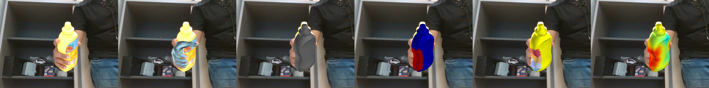
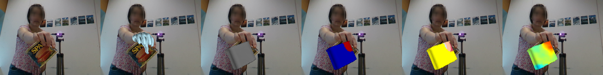
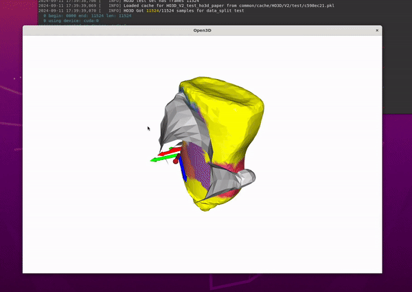

<!-- PROJECT LOGO -->
<br />
<p align="center">
  <h1 align="center">CPF: Learning a Contact Potential Field to Model the Hand-Object Interaction </h1>
  <p align="center">
    <a href="https://lixiny.github.io"><strong>Lixin Yang</strong></a>
    ·
    <a href="https://scholar.google.com/citations?user=WurpqEMAAAAJ&hl=en"><strong>Xinyu Zhan</strong></a>
    ·
    <a href="https://kailinli.top"><strong>Kailin Li</strong></a>
    ·
    <a href="https://wenqiangx.github.io"><strong>Wenqiang Xu</strong></a>
    ·
    <a href="https://jeffli.site"><strong>Jiefeng Li</strong></a>
    ·
    <a href="https://scholar.google.com.hk/citations?user=QZVQEWAAAAAJ&hl=en"><strong>Cewu Lu</strong></a>
  </p>
  <h4 align="center">ICCV 2021 & TPAMI 2024</h4>

  <p align="center">
    <!-- <a href="https://pytorch.org/get-started/locally/"></a><br><br> -->
    <a href='https://arxiv.org/abs/2012.00924'>
      
    </a>
    <a href='https://ieeexplore.ieee.org/abstract/document/10478277'>
    
    <a href='https://www.youtube.com/watch?v=MLGpBFYiEQ0'>
      
    </a>
  </p>
  <p align="center">
    
  </p>
</p>

This repo contains model, demo, training and test code.

<details open="open" style='padding: 10px; border-radius:5px 30px 30px 5px; border-style: solid; border-width: 1px;'>
  <summary>Table of Contents</summary>
  <ol>
    <li>
      <a href="#installation">Installation</a>
    </li>
    <li>
      <a href="#evaluation">Evaluation</a>
    </li>
    <li>
      <a href="#training">Training</a>
    </li>
    <li>
      <a href="#visualization">Visualization</a>
    </li>
    <li>
      <a href="#a-mano">A-MANO</a>
    </li>
    <li>
      <a href="#citation">Citation</a>
    </li>
  </ol>
</details>

## Installation
Following the [Instruction](docs/installation.md) to setup environment, assets, datasets and models.

&nbsp;
##  Evaluation
The evaluation process is divided into two steps:
1. dump the results from the hand-obj pose estimation (HoNet) and contact recovery (PiCR)
2. optimize the poses using the contact based on grasping energy optimizer (GEO)  

We provide a backup of our optimzation result at [here](https://huggingface.co/lixiny/CPF/tree/main/pred_bkp).  
The socres of following evaluations are provided in [docs/scores](docs/scores.md).

###  fphab
```bash
# (optional) visualize the pose and contact prediction: 
# the drawings are saved in `tmp/draw/honet+picr/fphab` 
$ python scripts/eval.py --cfg config/HONetPiCRPipeline_fphab.yml -g 0 -b 1 --callback draw 


# 1. dump the pose and contact predictions:
# the predictions are saved in `tmp/pred/honet+picr/fphab/dumped_pred`
$ python scripts/eval.py --cfg config/HONetPiCRPipeline_fphab.yml -g 0 -b 1 --callback dump


# 2. after dumping the results, fit pose using the grasp energy optimizer (GEO):
# the --data_prefix is the directory where dumped predictions are saved
# the optimized results are saved in `tmp/pred/honet+picr/fphab/optmized`
$ python scripts/fit.py --cfg config/HONetPiCRPipeline_fphab.yml -g 0,1,2,3 -w 16 \
        --data_prefix tmp/pred/honet+picr/fphab/dumped_pred
```


### HO3Dv2
@note: HO3Dv2 will use the hand-obj pose estimation network in ArtiBoost.  
Download the HO3Dv2 test set result at [here](https://huggingface.co/lixiny/CPF/blob/main/assets/eval_ho3dv2_clasbased_artiboost_iknet_SUBMIT.pkl), and put it in this porject as   
`assets/eval_ho3dv2_clasbased_artiboost_iknet_SUBMIT.pkl`

```bash
# (optional) visualize the pose and contact prediction: 
# the drawings are saved in `tmp/draw/artiboost+picr/ho3dv2`
$ python scripts/eval.py --cfg config/HOPose_PiCRPipeline_ho3dv2.yml -g 0 -b 1 --callback draw 


# 1. dump the pose and contact predictions (pose is from ArtiBoost model, contact is from PiCR):
# the predictions are saved in `tmp/pred/artiboost+picr/ho3dv2/dumped_pred` 
$ python scripts/eval.py --cfg config/HOPose_PiCRPipeline_ho3dv2.yml -g 0 -b 1 --callback dump 


# 2. after dumping the results, fit pose using the grasp energy optimizer (GEO):
$ python scripts/fit.py -c config/HOPose_PiCRPipeline_ho3dv2.yml -g 0,1,2 -w 12 \
        --data_prefix tmp/pred/artiboost+picr/ho3dv2/dumped_pred  \
        --lambda_repulsion_loss 2.0
```
<p align="center">
    <b>e.g. HO pose and contact prediction in ho3dv2 test set</b>
    
     </br>
</p>


visulize the optimization process using flag `runtime_viz`.  e.g. `python scripts/fit.py ... --runtime_viz`
<p align="center">
    
</p>

&nbsp;
## Training 
@note: We only provide the training code for the contact recovery network (PiCR).  
For training the Hand-Object Pose Etimation (HOPE) network, please refer to [handobjectconsist](https://github.com/hassony2/handobjectconsist), or [Semi-Hand-Object](https://github.com/stevenlsw/Semi-Hand-Object) or [ArtiBoost](https://github.com/lixiny/ArtiBoost.git).

### PiCR on fphab
```bash
$ python scripts/train_ddp.py --cfg config/train_PiCR_fphab.yml  -g 0,1 -b 48 -w 1 --eval_freq 100
```

### PiCR on HO3Dv2
```bash
$ python scripts/train_ddp.py --cfg config/train_PiCR_ho3d_mix.yml -g 0,1 -b 48 -w 4 --eval_freq 100
```
The results are saved at `exp/defualt_{exp_time}/checkpoints/checkpoint/PiCRI.pth.tar`)  
Once the traininig is done, you can modify the `MODEL.PICR.PRETRAINED` value in `config/xxxxPipeline_{dataset}.yml` to the saved checkpoint path, and evaluate the model again.

&nbsp;
## Visualization
We provide a visualization tool to visualize the contact dataset, and a tool to create the contact annotation from existing dataset. Please refer to [docs/contact_dataset](docs/contact_dataset.md).

&nbsp;
## A-MANO
We provide a pytorch MANO implementation: [manotorch](https://github.com/lixiny/manotorch) that provides the basic MANO layer: $V, J = \mathcal{M}(\theta, \beta)$, and features the 1) Anatomical Consistent Basis, 2) Anatomy Loss for pose correction, and a esay-to-use 3) Hand Pose Composition tool. 

| Anatomical Consistent Basis | Anatomy Loss | Hand Pose Composition | 
| :---: | :---: | :---: |
|   |    |   |     


&nbsp;
## Citation
If you find this work helpful, please consider citing us:
```
@inproceedings{yang2021cpf,
  author={Yang, Lixin and Zhan, Xinyu and Li, Kailin and Xu, Wenqiang and Li, Jiefeng and Lu, Cewu},
  title={{CPF}: Learning a Contact Potential Field To Model the Hand-Object Interaction},
  booktitle={Proceedings of the IEEE/CVF International Conference on Computer Vision (ICCV)},
  month={October},
  year={2021},
  pages={11097-11106}
}

@artical{yang2024learning,
  author={Yang, Lixin and Zhan, Xinyu and Li, Kailin and Xu, Wenqiang and Zhang, Junming and Li, Jiefeng and Lu, Cewu},
  journal={IEEE Transactions on Pattern Analysis and Machine Intelligence}, 
  title={Learning a Contact Potential Field for Modeling the Hand-Object Interaction}, 
  year={2024},
  volume={46},
  number={8},
  pages={5645-5662},
  keywords={Pose estimation;Task analysis;Grasping;Three-dimensional displays;Contacts;Semantics;Image reconstruction;Contact modeling;grasping pose generation;hand-object pose estimation},
  doi={10.1109/TPAMI.2024.3372102}
}
```