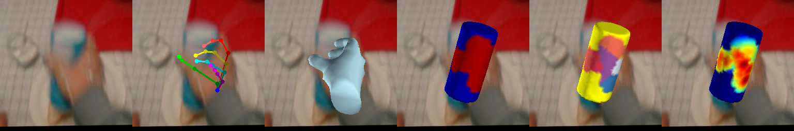
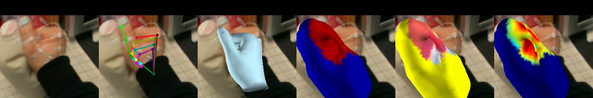
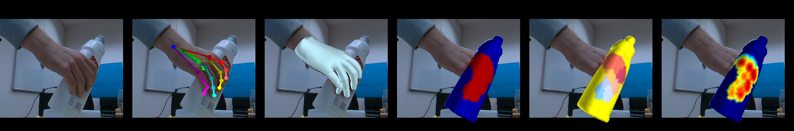
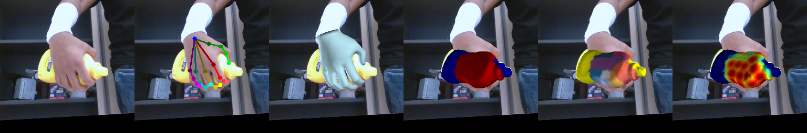
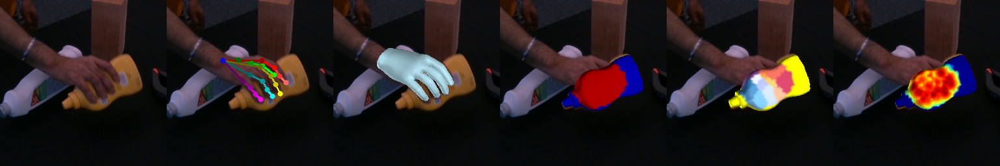
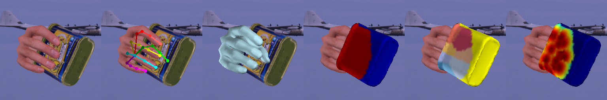

## Visualize Contact betwen Hand-Object Meshes

Run the following command to visualize the data and annotation 

### fphab
```bash
# fphpab dataset, train split, visualize 3d hand & object mesh
$ python scripts/viz_dataset.py  -d fphab -s train -m 3d_hand_obj

# fphpab dataset, train split, visualize 3d hand & object mesh, and contact parts
$ python scripts/viz_dataset.py -d fphab -s train -m 3d_hand_obj_contact 

# fphpab dataset, test split, visualize 3d hand & object mesh, and contact parts
$ python scripts/viz_dataset.py -d fphab -s test -m 3d_hand_obj_contact 
```
<p align="center">
     </br>
     </br>
</p>

### ho3dv2 
```bash
# ho3dv2 dataset, train split, visualize 3d hand & object mesh
$ python scripts/viz_dataset.py -m 3d_hand_obj -d ho3dv2 -s train

# ho3dv2 dataset, train split, visualize 3d hand & object mesh, and contact parts
$ python scripts/viz_dataset.py -m 3d_hand_obj_contact -d ho3dv2 -s train

# @note: no hand gt is provided in the ho3dv2 test split 
```
<p align="center">
     </br>
     </br>
</p>

### dexycb
used for assisting with training the contact recovery model on YCB objects
```bash
$ python scripts/viz_dataset.py -d dexycb -s train -m 3d_hand_obj_contact 
# @note: contact for test split is not provided. 
```
<p align="center">
     </br>
</p>

### synthetic data  (ho3dsyntht, ho3dycba)
used for assisting with training the contact recovery model on YCB objects
```bash
$ python scripts/viz_dataset.py -d ho3dsyntht -s train -m 3d_hand_obj_contact
$ python scripts/viz_dataset.py -d ho3dycba   -s train -m 3d_hand_obj_contact
```
<p align="center">
     </br>
     </br>
</p>

### mix data (ho3dv2 + dexycb + ho3dsyntht + ho3dycba)
```bash
$ python scripts/viz_dataset.py -d allmix -s train -m 3d_hand_obj_contact
```
</br></br>
## Generate Contact Annotation
if you want to prepare the contact annotation for your own dataset, following the same format as  CPF, you need:
1. Wrap your own dataset using our interface `HODataset`([hdata](../lib/datasets/hdata.py)), implement those `get_xxx` functions required for `data_mode == 3d_hand_obj`. A good practice is to follow the `fphab.py`, `ho3d.py`, and `dexycb.py` 
2. follow the demo in `scripts/prepare_contact_info.py` to generate the contact annotation. e.g. for dexycb dataset, we have:
    ```bash
    $ python scripts/prepare_contact_info.py -d dexycb -s train (--replace)
    # careful! --replace will replace the existing contact annotation. 
    ```

